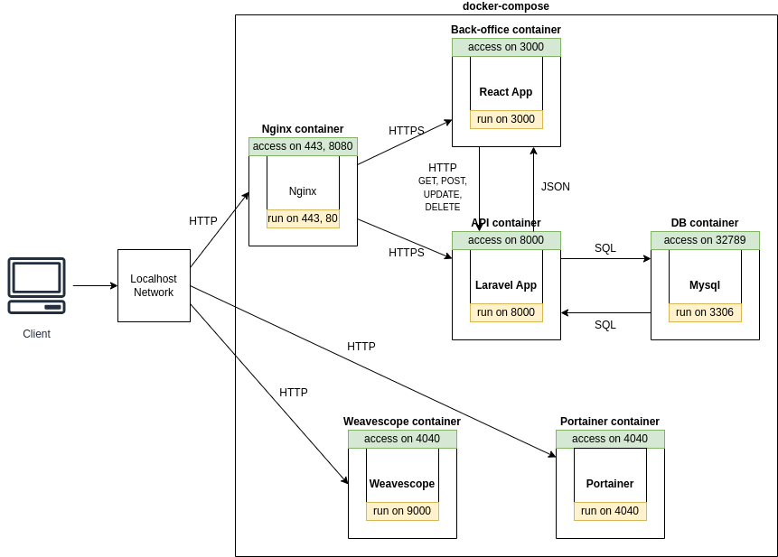

# Projet Microservices M2

## Objectif

Développer un projet full stack en architecture microservices en respectant au mieux un cahier des charges techniques.

[Rapport de mi-parcours](project/Rapport.md)

Le projet final est disponible dans le dossier [project](project/).

## Spécifications du projet

Ce projet consiste en la création d'une application web basée sur une architecture microservices. L'API backend est développée en Laravel, utilisant une base de données MySQL, tandis que le frontend est construit avec React pour la gestion des données. L'ensemble de l'infrastructure est conteneurisé avec Docker, avec une gestion simplifiée grâce à Portainer.io. Weave Scope est également utilisé pour la surveillance des conteneurs. Nginx est utilisé en tant que reverse proxy pour améliorer la sécurité, et l'application est sécurisée avec SSL/HTTPS.

## Composants et Architecture



## Installation et utilisation

### Prérequis

[Mkcert](https://github.com/FiloSottile/mkcert) sert à générer des certificats SSL auto-signés pour le développement local qui soient reconnus par les navigateurs.
- S'il n'est pas présent sur la machine, il est possible de l'installer en suivant les instructions fournies dans la documentation officielle.
- Une fois installé, il faut lancer la commande suivante pour installer et configurer une autorité de certification locale sur le système et les navigateurs :
```
mkcert -install
```
- Il peut être nécessaire de redémarrer le navigateur pour que les certificats soient reconnus.

### Installation

1. Cloner le dépôt Git

```
git clone https://github.com/Pauline-Mdt/hitema_microservices.git
```

2. Lancer les conteneurs Docker

```
docker-compose up -d
```

3. Accéder aux services

    - **API** : https://0.0.0.0/api
    - **Back-office** : https://0.0.0.0/
   - **Portainer.io** : http://0.0.0.0:9000/
   - **Weave Scope** : http://0.0.0.0:4040/

### Utilisation

- **API** : Des routes qui ne nécessitent pas d'authentification sont disponibles, par exemple :
    - https://0.0.0.0/api/tattooists
    - https://0.0.0.0/api/subscribers

- **Back-office** : La base de données étant chargée avec des données fictives, il est possible de se connecter avec les identifiants suivants :
```
margot57@example.org
```
```
password
```

- **Portainer.io** : Il sera nécessaire de créer un compte administrateur lors de la première connexion, puis de se connecter avec les identifiants créés. Une fois connecté, il est possible de gérer les conteneurs Docker.

- **Weave Scope** : Il est possible de visualiser les conteneurs Docker et leurs interactions sans authentification.

## Automatisation

Le workflow GitHub Actions a été mis en place pour automatiser plusieurs tâches à chaque push sur le dépôt Git.

### Tests

- Les tests de l'API Laravel
- Les tests du back-office React
- La vérification de l'état des conteneurs Docker
- L'accessibilité de la base de données MySQL

### Build et déploiement des images Docker

- Le build des images Docker
- Le déploiement des images sur Docker Hub, consultables ici :
    - [API Laravel](https://hub.docker.com/r/paulinemdt/microservice-laravel-image) 
    - [Back-office React](https://hub.docker.com/r/paulinemdt/microservice-react-image)

### Validation des tests et déploiement


Tous les workflows sont consultables dans l'onglet [Actions](https://github.com/Pauline-Mdt/hitema_microservices/actions) du dépôt Git.